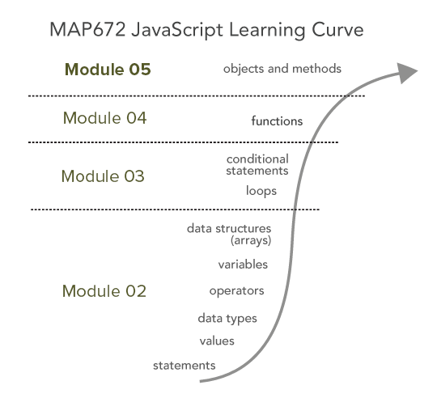
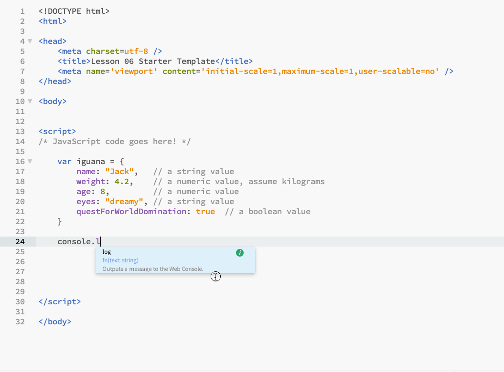
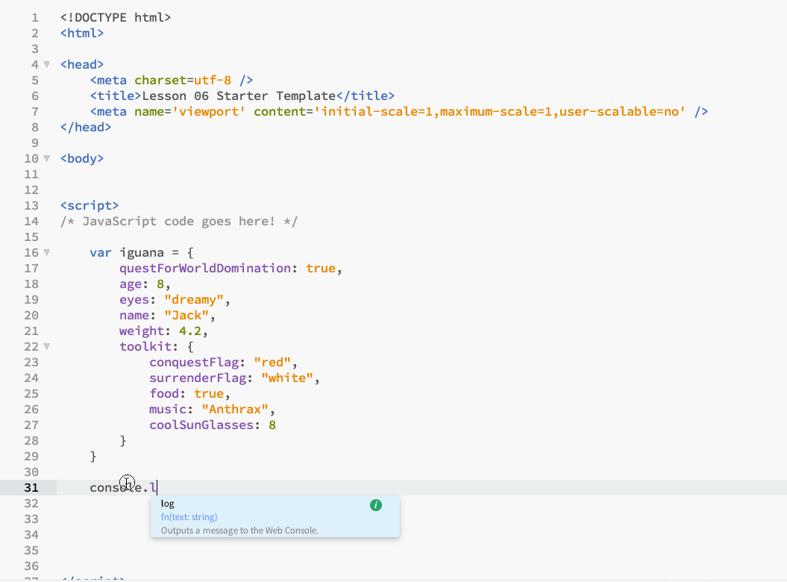

# Lesson 05: JavaScript Objects and Methods

## Goals

You will learn how to create and access a JavaScript Object, a sophisticated data structure that can hold data and functions. You will learn how to identify and use object methods, special functions that operate only on certain objects.

## Table of contents

<!-- TOC -->

- [Lesson 05: JavaScript Objects and Methods](#lesson-05-javascript-objects-and-methods)
    - [Goals](#goals)
    - [Table of contents](#table-of-contents)
    - [Overview](#overview)
    - [What are JavaScript Objects?](#what-are-javascript-objects)
    - [Creating JavaScript Object Properties](#creating-javascript-object-properties)
    - [Accessing JavaScript Object Properties](#accessing-javascript-object-properties)
    - [Updating JavaScript Object Properties](#updating-javascript-object-properties)
        - [Looping through objects](#looping-through-objects)
    - [JavaScript methods](#javascript-methods)
    - [Additional native JS methods](#additional-native-js-methods)
    - [Addendum I: Looping through JS objects](#addendum-i-looping-through-js-objects)
    - [Resources and Additional Reading](#resources-and-additional-reading)
    - [Glossary:](#glossary)

<!-- /TOC -->

## Overview 

This lesson introduces you to another JavaScript data structure: the JavaScript Object. This object is a data type (or data "structure") used for storing, accessing, and updating various values. You'll learn how to create these, populate them with key/value pairs, access these values, and update the object with new properties. We'll also learn how to loop through objects, as well as how objects make use of a special kind of function known as a method.



This lesson brings us up and over the initial JavaScript learning curve. After this, we'll be well-prepared to understand and use JavaScript mapping libraries such as Leaflet to make dynamic, interactive web maps.

As usual, read this lesson carefully and practice writing the examples in the _lesson-05/index.html_ file. Save these examples and commit/push to your repo along with the lab submission. We use objects a lot in web mapping, so carefully study these examples.

You'll be submitting the _lesson-05/index.html_ file for **1 pt** of the assignment. See the [Lab 05 instructions](lab-05/).


## What are JavaScript Objects?

In Module 02, we learned how to store data within a data structure known as an array, which ordered elements within it according to their specific index. While arrays are very useful in web programming, the real power of JavaScript comes with another more complex data type: the **object**.

Rather than storing information in a specific sequential order (like we see in an array), objects store information as a collection of **properties**. Each property comprises a property **name** and an associated property **value**. The property name is also sometimes referred to as a key; as in, properties are made of "key/value" pairs.

We also sometimes refer to JavaScript objects as "associative arrays" because key identifiers are _associated_ with their respective values. If you are familiar with other programming languages, the object data structure is similar to dictionaries (such as in Python) or hash tables (in R and Ruby).

You may have heard of something known as "object-oriented programming." In programming terms, this means that we attempt to treat collections of information as if they were real objects in the world. For example, if we say "coffee cup," you know what we mean and what you can do with it. We don't have to provide details on things like it can hold hot liquids, has a handle, you can drink from it, etc. And since our goal with programming is to _map_ actual lived spaces and geographies in the world, using objects modeled on reality makes sense for us.

We can characterize objects in the world by two things: particular _properties_ they exhibit and _things they do_.

For example, an iguana has particular properties such as a name, weight, skin color. When these properties all have specific values, such as "Larry," 25 (ounces), "green," these are properties of a particular iguana, and we can use JavaScript objects to capture these properties. And there may be some properties that are appropriate for other objects like "coffee cup" that don’t make sense for an iguana, such as the roast or level of caffeine content.

Iguanas also do things: they may eat leaves, stare at you with their dreamy eyes, introduce themselves in clearly articulated English and demand your servitude (okay, this is getting a little silly here). JavaScript objects also capture this aspect of _doing things_ that real-world entities exhibit. The functionality of doing things is captured in JavaScript through an objects **method**. This will make more sense through the examples below, but first, let’s get the syntax down for creating and accessing objects.


## Creating JavaScript Object Properties

While we do store the reference to the object in a variable, the syntax of an object is, as we’d expect, different from that of an array. Rather than using square brackets, a JavaScript object uses curly braces, `{ }`.

```javascript
var myObject = {}; // declare and define an empty object
console.log(myObject);
```

Within those curly braces:

* Objects encode information using one or more properties.
* A colon separates the property’s name from its value, and properties within an object structure are separated by commas.

```javascript
var myObject = {
  propertyName: "propertyValue"
}; // declare and define an empty object
console.log(myObject);
```

Property names are always written to the left of the colon and must be unique within that object (i.e., there can be only one property name of _height_ within an object). While we often don’t write the property names with quotation marks around them, we can, as technically they are strings. (later on, we’ll be working with a specific kind of object known as a JSON object, which will require property names to be written using quotation marks.)

The value associated with a property name may be of any data type (i.e., numbers, Booleans, strings, arrays … even other objects or functions!).

Let’s start by building a simple object that represents our friendly iguana, log that object to the Console, and inspect the output in our browser.

```javascript
var iguana = {
  name: "Jack", // a string value
  weight: 4.2, // a numeric value, assume kilograms
  age: 8, // a numeric value
  eyes: "dreamy", // a string value
  questForWorldDomination: true // a boolean value
};
console.log(iguana);
```


*Logging a JS object to the Console*

Note that there is no inherent order to the property/value pairs within an object (some browsers will order them alphabetically by key, but you can't count on this across all browsers). We could have just as well defined our object as:

```javascript
var iguana = {
  questForWorldDomination: true,
  age: 8,
  eyes: "dreamy",
  name: "Jack",
  weight: 4.2 // assume kilograms
};
console.log(iguana);
```

We can also assign objects as the value of an object property, a practice known as "nesting objects." Say our iguana has a toolkit he brings with him when on his quest for world domination (and apparently he wants to listen to heavy metal and wear cool sunglasses):

```javascript
var iguana = {
  questForWorldDomination: true,
  age: 8,
  eyes: "dreamy",
  name: "Jack",
  weight: 4.2,
  toolkit: {
    conquestFlag: "red",
    surrenderFlag: "white",
    food: true,
    music: "Anthrax",
    coolSunGlasses: 8
  }
};
console.log(iguana);
```

**What follows is important so read carefully!** Note that when we inspect this nested object within the Console, we can drill down within it to access the key/values.


*Drilling down within the Console to inspect an object*

## Accessing JavaScript Object Properties

How do we then access those property values within an object using JavaScrip? Within an array, we used bracket notation and the index value for accessing values, but because objects have no inherent order, this doesn’t work. In other words, we can’t count on the fact that the property questForWorldDomination will always be the first value, so `iguana[0]` will not work.

Instead, we use the property names themselves. There are two ways to do this: one using dot notation and the other using bracket syntax.

Here's an example using dot notation to access the property values associated with the `name` and `weight` of the `iguana` object:

```javascript
var iguana = {
  name: "Jack",
  weight: 4.2, // assume kilograms
  age: 8,
  eyes: "dreamy",
  questForWorldDomination: true
};
console.log(iguana.name); // output "Jack"
console.log(iguana.weight); // output 4.2
```

What about accessing key/values within that nested object, `toolkit`? Using dot notation, we can string together property names to "drill down" into the structure:

```javascript
var iguana = {
  questForWorldDomination: true,
  age: 8,
  eyes: "dreamy",
  name: "Jack",
  weight: 4.2,
  toolkit: {
    conquestFlag: "red",
    surrenderFlag: "white",
    food: true,
    music: "Anthrax",
    coolSunGlasses: 8
  }
};
console.log(iguana.toolkit.music); // will output "Anthrax"
```

The other way is to use bracket notation, though importantly, note how we need to write the property name with quotation marks around it:

```javascript
var iguana = {
  name: "Jack",
  weight: 4.2, // assume kilograms
  age: 8,
  eyes: "dreamy",
  questForWorldDomination: true
};
console.log(iguana["name"]); // output "Jack"
console.log(iguana["weight"]); // output 4.2
```

Similarly, we can use bracket notation to access our nested object property values, or even mix and match dot notation with bracket syntax (see the example outputting how many sunglasses the iguana is carrying here)!

```javascript
var iguana = {
  questForWorldDomination: true,
  age: 8,
  eyes: "dreamy",
  name: "Jack",
  weight: 4.2,
  toolkit: {
    conquestFlag: "red",
    surrenderFlag: "white",
    food: true,
    music: "Anthrax",
    coolSunGlasses: 8
  }
};
console.log(iguana["toolkit"]["music"]); // will output Anthrax:
console.log(iguana["toolkit"].coolSunGlasses); // will output 8
```

## Updating JavaScript Object Properties

We can also use both of these approaches to change/modify property values, as well as add new properties to an existing object. Let’s update our iguana’s information first. We do this by re-assigning the value to the property name.

We can use the dot notation with an assignment operator:

```javascript
var iguana = {
  name: "Jack",
  weight: 4.2, // assume kilograms
  age: 8,
  eyes: "dreamy",
  questForWorldDomination: true
};
console.log(iguana.weight); // output 4.2
console.log(iguana.age); // output 8

iguana.weight = 5.2;
iguana.age = 9;

console.log(iguana.weight); // output 5.2
console.log(iguana.age); // output 9
```

Likewise, we can also use the bracket notation to do the same thing, again using an assignment operator:

```javascript
var iguana = {
  name: "Jack",
  weight: 4.2, // assume kilograms
  age: 8,
  eyes: "dreamy",
  questForWorldDomination: true
};
console.log(iguana.weight); // output 4.2
console.log(iguana.age); // output 8

iguana["weight"] = 6.1;
iguana["age"] = 10;

console.log(iguana.weight); // output 6.1
console.log(iguana.age); // output 10
```

We can also use both dot and bracket notation to add new properties easily to our object. Let’s give our iguana with some additional properties after we've created it:

```javascript
var iguana = {
  name: "Jack",
  weight: 4.2, // assume kilograms
  age: 8,
  eyes: "dreamy",
  questForWorldDomination: true
};
console.log(iguana); // output entire object for inspection

iguana.color = "green";
iguana.madGenius = true;

console.log(iguana); // inspect the Console to see that object has the additional properties
```

Let’s do the same thing using bracket notation.

```javascript
var iguana = {
  name: "Jack",
  weight: 4.2, // assume kilograms
  age: 8,
  eyes: "dreamy",
  questForWorldDomination: true
};
console.log(iguana); // output entire object for inspection

iguana["color"] = "purple";
iguana["unlovedAsBaby"] = true; // hence his need to compensate

console.log(iguana); // object with additional properties
```

Within this lesson, we’ve presented two different ways of accessing the property values of an object, as well as modifying them and/or adding new properties to an object. What’s the difference between these two, and when should you use one over the other? The simplest answer is that you should try to use the dot syntax when possible. It's easier to write and read.

According to the [Airbnb style guide](https://github.com/airbnb/javascript/tree/es5-deprecated/es5#properties), you should use the dot notation when accessing properties and the bracket notation when accessing properties with a variable. Refer to their example for additional clarification.

You need to be aware of both ways, especially when you start reading through someone else's code. For your stuff pick whichever one makes the most sense to you but keep a couple of things in mind:

* **dot notation**:
  * is computationally faster than bracket notation (and we always like things fast!)
  * is cleaner to write and read than bracket notation
* **bracket notation**:
  * allows for special characters to be used within a property name (e.g., `"spam i am": "Not!"`)
  * allows one to access object properties while looping through them (see the next code example below)
  * is also used for creating unique property names within an object when updating that object within a looping structure. OK, that is a bit difficult to process, so let’s look at an example. This code below creates a new object and then creates a new property name using the for loop’s iterator variable, assigning a value from the array to each:

```javascript
var myObject = {};
someValues = ["Green Eggs", "Ham", "Toast", "Caterpillar Jam"]
for (var i = 0; i < someValues.length; i++) {
  myObject["id_" + i] = someValues[i];
}
console.log(myObject);
```

See the answers to this very question on Stack Overflow: [JavaScript property access: dot notation vs. brackets?](http://stackoverflow.com/questions/4968406/javascript-property-access-dot-notation-vs-brackets)

Don’t worry too much about this last example right now if it doesn’t make sense. What’s more important is to understand how to iterate through an object, which is what we’re going to cover now.

### Looping through objects

Let’s say we want to iterate (or loop) through the properties within our object and access the property values. To do this, we’ll use a for loop, though in a slightly different way than the one we used for iterating through an array. Instead of the `for(var i = 0; i < n; i++){ }` structure, we’ll use a `for … in` statement, which iterates over each property name (also referred to as a 'key') within the object.

```javascript
for (var propName in object) {
  // code here
}
```

As an example, let log the object’s property names (its keys) to the console:

```javascript
var iguana = {
  name: "Jack",
  weight: 4.2, // assume kilograms
  age: 8,
  eyes: "dreamy",
  questForWorldDomination: true
};

for (var key in iguana) {
  console.log(key); // outputs "name", "weight", "age", "eyes", "questForWorldDomination"
}
```

We can access the values associated with each of those properties using our bracket notation:

```javascript
var iguana = {
  name: "Jack",
  weight: 4.2, // assume kilograms
  age: 8,
  eyes: "dreamy",
  questForWorldDomination: true
};

for (var key in iguana) {
  console.log(iguana[key]); // outputs "Jack", 4.2, 8, "dreamy", true
}
```

Logging both the key and the key's value further clarifies how this looping process is working:

```javascript
var iguana = {
  name: "Jack",
  weight: 4.2, // assume kilograms
  age: 8,
  eyes: "dreamy",
  questForWorldDomination: true
};

for (var key in iguana) {
  console.log(key + ": " + iguana[key]); // "name: Jack", "weight: 4.2", "age: 8"
}
```

We can use whatever word we want in place of 'key.' and it is sometimes useful to use meaningful names to better keep track of things in our code:

```javascript
for (var qualities in iguana) {
  console.log(iguana[qualities]);
}
```

Using shorter names makes the code easier to read and maintain:

```javascript
for (var i in iguana) {
  console.log(iguana[i]);
}
```

Because we can access the values in objects directly (via dot and bracket notation), there’s often no need to loop (if we already know the name of the property we're looking for). This technique makes accessing data in objects computationally faster than looping through an array to find a match. However, you need to know your data properties.

JavaScript objects are built from "base object classes" and may inherit additional properties from these "prototypes." To ensure we're only accessing our intended properties when using the `for (var prop in object)` syntax, we want to use a conditional check using the object's `.hasOwnProperty()` method. This method will avoid iterating over properties in the prototype chain in complex objects as well:

```javascript
var iguana = {
  name: "Jack",
  weight: 4.2, // assume kilograms
  age: 8,
  eyes: "dreamy",
  questForWorldDomination: true
};

for (var key in iguana) {
  if (iguana.hasOwnProperty(key)) {
    console.log(key + ": " + iguana[key]); // "name: Jack", "weight: 4.2", "age: 8"
  }
}
```

So far, within the lesson, we've explored how objects, both in the real world and within the JavaScript coding environment, have particular properties. Let's now learn how we use JavaScript methods to control the behavior of objects.

## JavaScript methods

You might be thinking, "Oh no! Functions and objects are confusing enough. Now something else!?" The good news is that **methods** are very similar to functions, so there isn’t too much more to grapple with regarding syntax and use. Methods have the same syntax structure, accept arguments, and return values just like functions.

So what’s the difference between a function and method then? While a function stands alone, a method is associated with a particular object and operates on data and functionality associated with that object.

Let’s run through some examples of methods using our friendly iguana and the notion of "object-oriented programming" to first conceptually grasp what methods are before looking at some more practical examples?

Again, above, we discussed how objects in the real world have both properties, and _do things_? So far, we’ve been using object properties to store only simple data types (i.e., Strings, Booleans, Numbers). But a property value can also be a more complex data type, such as a function! Whoa! What does this mean?

Let’s give our iguana Jack the ability to greet us as our new overlord. After all, what’s the point of world domination if you can’t interact with your subjects?

Examine the following addition to the `iguana` object. We create a new property name called `greeting` and assign a function as its value. Then, to call or invoke this function, we attach the method call to the object using dot notation. This allows the object `iguana` some functionality, beyond merely storing static property values.

```javascript
var iguana = {
  name: "Jack",
  weight: 4.2,
  age: 8,
  eyes: "dreamy",
  questForWorldDomination: true,
  greeting: function() {
    console.log("Hello. I am your new overlord.");
  }
};

iguana.greeting();
```

Though recall from the previous module how more powerful functions can receive information from the caller? We can modify this object method to accept a message as a parameter, and send that message as an argument when we call the method:

```javascript
var iguana = {
  name: "Jack",
  weight: 4.2,
  age: 8,
  eyes: "dreamy",
  questForWorldDomination: true,
  greeting: function(message) {
    console.log(message);
  }
};

iguana.greeting("Howdy there."); // output is Howdy there.
iguana.greeting("I am your new overlord."); // output is I am your new overlord.
```

These examples demonstrate that methods are functions, which again, are the values of particular object properties. We can have that function return values as well. Let’s say our iguana wants to calculate his BMI. After all, he needs to be at his peak performance to take over the world. Similar to examples in Module 05, we can pass in two values when we invoke the method:

```javascript
var iguana = {
  name: "Jack",
  weight: 4.2, // kilos
  length: 1.5, // meters
  age: 8,
  eyes: "dreamy",
  questForWorldDomination: true,
  calculateBMI: function(w, l) {
    return w / (l * l); // now you know how to calculate BMI, BONUS!
  }
};
var result = iguana.calculateBMI(4.2, 1.5);
console.log(result); // output is 1.87 which is really underweight,
```

Note, in the example above we passed in the two values 4.2 kilos and 1.5 meters directly, but we can also access the values we set in our iguana object.

```javascript
var result = iguana.calculateBMI(iguana.weight, iguana.length);
console.log(result); // output is still 1.87
```

However, the object _iguana_ here already "knows" its values of weight and length. We don’t have to send those values into the function when we call it. Instead, within the object’s method (the function _calculateBMI_ we can access these values using a specially reserved keyword in Javascript: `this`.

```javascript
var iguana = {
  name: "Jack",
  weight: 4.2, // kilos
  length: 1.5, // meters
  age: 8,
  eyes: "dreamy",
  questForWorldDomination: true,
  calculateBMI: function() {
    var w = this.weight;
    var l = this.length;
    return w / (l * l);
  }
};

var result = iguana.calculateBMI();
console.log(result); // output is still 1.87
```

The `this` keyword can be conceptually challenging to grasp and use effectively. The hard part is, it means different things in different programming languages, and means something different in JavaScript depending on how functions are called. In this case, however, when a function is called as a method of an object, `this` refers to the object on which that method is called.

We could also get real savvy and store some information within an object, and pass that as an argument to the method. Let’s suppose the iguana is preparing to invade some cities in Kentucky and wants to process some information about the city first. In this case, the object is `lexData`, and it is being passed to the method `iguana.invasionPlans` in the object `iguana`.

```javascript
var iguana = {
  name: "Jack",
  weight: 4.2,
  age: 8,
  eyes: "dreamy",
  questForWorldDomination: true,
  invasionPlans: function(inData) {
    // iguana can do something with data here
    console.log(inData);
  }
};

var lexData = {
  lat: 38.23,
  lon: -89.21,
  name: "Lexington",
  pop: 329959
};

iguana.invasionPlans(lexData);
```

What’s the point of all this? After all, we won’t necessarily be creating iguana objects that calculate their intent to dominate us, although that would be cool (note: this lesson was edited by Prof. Zook, who is sometimes obsessed with iguanas).

However, we will be using a lot of methods when we begin more serious mapping using Leaflet. It’s important to conceptually grasp what they are, as well as become familiar recognizing a method, which again is attached to an object using dot notation and often passes various arguments (some of which will be JavaScript objects!) within its parentheses.


## Additional native JS methods

Before we wrap up, let’s briefly consider a few more methods using some of JavaScript’s native, built-in objects.

We’ve already been using a method all along, from the first line of JavaScript we wrote. In the `console.log()` statement, `.log()` is a method available on the `console` object. We’ve been passing it arguments every time we invoke it (i.e., `console.log("Hello Map")`). In fact, there a [bunch of other methods](https://developer.mozilla.org/en-US/docs/Web/API/Console) that can act upon the console as well.

There are lots of common methods around. In Module 02 we introduced String data types, which have particular methods that act upon them. JavaScript automatically converts primitive data types (strings, numbers, etc.) to objects so we can use their built-in methods. For example, strings have a method named _concat_ that operates like the plus sign operator when placed between two strings:

```javascript
var cityName = "Lexington";
console.log(cityName);
var cityNameWithState = cityName.concat(", KY"); // concat method concatenates two Strings
console.log(cityNameWithState); // output is "Lexington, KY"
```

This example takes the original value of `cityName`, concatenates it with the String contained within the method’s parentheses, and assigns the return value to variable cityNameWithState. You can also use the `.toUpperCase()` method to change a city’s name. See below.

```javascript
var cityName = "Lexington";
var cityNameCaps = cityName.toUpperCase();
console.log(cityNameCaps); //output is LEXINGTON
```

You can also use methods to look inside a string value; see the example below.

```javascript
var cityName = "Lexington";
console.log(cityName.charAt(4)); // returns the String
// character at index 4, "n"
console.log(cityName.indexOf("x")); // returns the index (2) of the
// first character found of "x"
```

Another useful one is the numeric method, `toLocaleString()`, which nicely formats a number and returns it as a string type. Let's say you want to easily format some long decimal numbers (like we've already been doing within the popups used in our Leaflet maps in the labs) and even insert some commas:

```javascript
var pop = 1200000;
var area = 683.24;
var density = pop / area;

console.log(density); // output is 1756.337450968913

var output = density.toLocaleString();

console.log(output); // output is 1,756.337
```

We’re not going to exhaustively cover all the [useful string methods in JavaScript](https://developer.mozilla.org/en-US/docs/Web/JavaScript/Reference/Global_Objects/String) (though feel free to take a little time to look them up and play with the examples!).

The key point we want you to take away from here is that when you see some JavaScript with a `.someMethod(possibleExpressionsHere)` attached to it, you recognize it as a method.

Also important is to know that methods operate on particular objects or data types. So while a method named `.toUpperCase()` means something when attached to a string, it won’t do anything when attached to an array (in fact, it will throw an error).

As we have discovered, JavaScript [arrays have their methods](https://developer.mozilla.org/en-US/docs/Web/JavaScript/Reference/Global_Objects/Array). Of particular utility are the `.push()` and `.pop()` methods which pushes a new element to the end of an array and removes the last item from an array, respectively.

```javascript
var cities = ["Lexington", "Bowling Green"];
console.log(cities); // output is ["Lexington", "Bowling Green"]
cities.push("Frankfort");
console.log(cities); // output is ["Lexington", "Bowling Green", "Frankfort"]
cities.pop();
console.log(cities); // output is ["Lexington", "Bowling Green"]
```

## Addendum I: Looping through JS objects

In the ES 6 standard, we have other ways to loop through JS objects that you will likely encounter in the wild. The `for...in` loop works well, but it can access private properties unless you attach the `hasOwnProperty()` method. Because of this limitation, we can use three new methods that convert an object to array and then access elements in two unique ways. 

First, we need to convert our object to an array. Why, you ask? While objects are easier to read and maintain, if you need to access every property in an object, arrays are faster. We have three methods to convert an object to an array, depending on what properties you need to access.

1. `Object.keys(objName)` method will return an array of property names. 
2. `Object.values(objName)` returns the property values as an array. 
3. `Object.entries(objName)` returns an array of keys and values, coupled as an array. 

Let's explore an example.

```js
const kyCities = {
  Louisville: 620118,
  Lexington: 323780,
  "Bowling Green": 68401
}
Object.keys(kyCities) // returns ["Louisville", "Lexington", "Bowling Green"]
Object.values(kyCities) // returns [620118, 323780, 68401]
Object.entries(kyCities) // [["Louisville", 620118], ["Lexington", 323780], ["Bowling Green", 68401]]
```

To loop through this object, assign output from these methods to a variable and use a `for` loop. Below is a simple example.

```js
const kyCitiesArray = Object.entries(kyCities)
for (let i=0; i < kyCitiesArray.length; i++) {
  console.log(kyCitiesArray[i])
  let myOutput = `${kyCitiesArray[i][0]} has a 2019 population of ${kyCitiesArray[i][1].toLocaleString()}.`
  console.log(myOutput)
}
```

Let's use the newer `for...of` statement, which allows us to iterate over an array in a cleaner syntax. Applying this approach yields the following code block.

```js
for (const element of kyCitiesArray) {
  console.log(element)
  let myOutput = `${element[0]} has a 2019 population of ${element[1].toLocaleString()}.`
  console.log(myOutput)
}
```

You might be wondering, why not use the `for...in` loop? While we can use this type of loop, the iterating variable returns the index value and is generally not recommended for arrays. Let's compact our code even more. Because we are accessing a two-element array, we can use an array as the iterating variable. 

```js
for (const [key, value] of kyCitiesArray) {
  let myOutput = `${key} has a 2019 population of ${value.toLocaleString()}.`
  console.log(myOutput)
}
```

Finally, another common approach you'll find to loop through objects converted to arrays is with the [`forEach()`](https://developer.mozilla.org/en-US/docs/Web/JavaScript/Reference/Global_Objects/Array/forEach) method. The method requires one argument, the iterating variable.


```js
Object.entries(kyCities).forEach(([key, value]) => {
  let myOutput = `${key} has a 2019 population of ${value.toLocaleString()}.`
  console.log(myOutput)
})
```

With these techniques, you should now be able to identify and use this new code in your projects.


## Resources and Additional Reading

* [The Secret Life of Objects](http://eloquentjavascript.net/06_object.html)
* [Working with objects](https://developer.mozilla.org/en-US/docs/Web/JavaScript/Guide/Working_with_Objects)
* [JavaScript Objects](http://www.w3schools.com/js/js_objects.asp)


## Glossary:

* **object**: a data structure used within JavaScript designated by curly braces and composed of comma-separated properties
* **object-oriented programming**: an approach to computer programming that treats data objects like real-world objects, giving them particular characteristics and actions
* **property** (re: objects): a type of variable that is attached to an object and helps define the characteristics of that object
* **property name**: a case-sensitive String variable used to reference an object’s property
* **property value**: the value of an object’s property
* **method**: a value of an object’s property, when that value is a function
* `this` **keyword**: when used inside a method’s scope, `this` refers to the object on which the method is called
