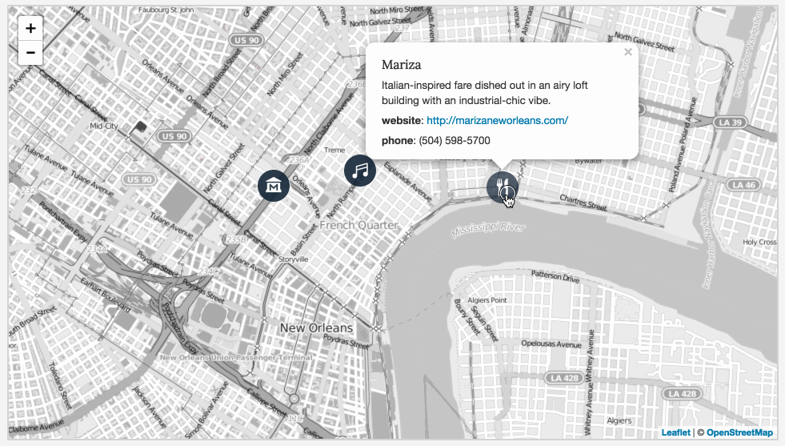
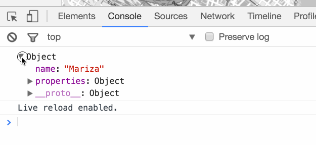
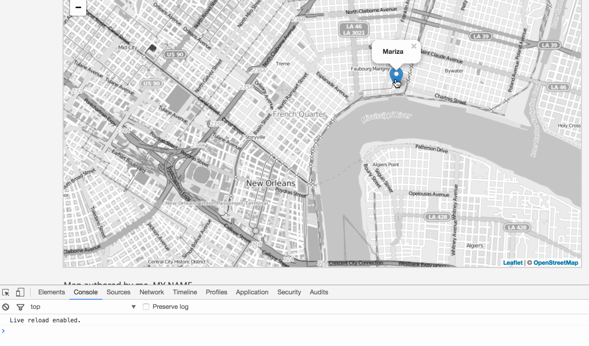
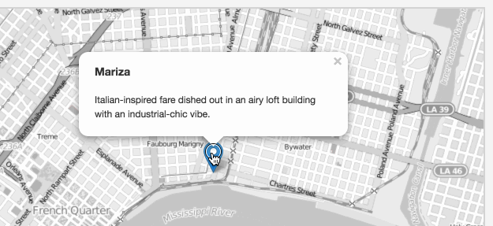
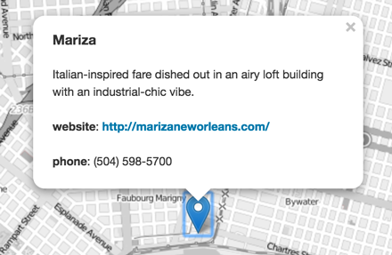
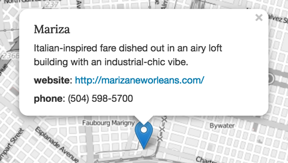
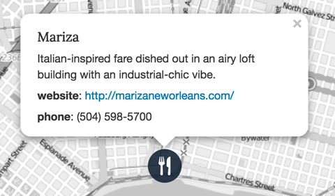

# Lab 05: Using JavaScript Objects to Store Data

## Table of contents
<!-- TOC -->

- [Lab 05: Using JavaScript Objects to Store Data](#lab-05-using-javascript-objects-to-store-data)
    - [Table of contents](#table-of-contents)
    - [Overview](#overview)
    - [Part I. Understanding the lesson (1 pt)](#part-i-understanding-the-lesson-1-pt)
    - [Part II. Quiz (3 pts)](#part-ii-quiz-3-pts)
    - [Part III. Following a short mapping tutorial (6 pts)](#part-iii-following-a-short-mapping-tutorial-6-pts)
        - [Step 1: Adjust the map's center coordinates and zoom level](#step-1-adjust-the-maps-center-coordinates-and-zoom-level)
        - [Step 2: Build the data structure](#step-2-build-the-data-structure)
        - [Step 3: Place marker(s) on map](#step-3-place-markers-on-map)
        - [Step 4: Building an informative popup window](#step-4-building-an-informative-popup-window)
        - [Step 5: Using an SVG image for a marker icon](#step-5-using-an-svg-image-for-a-marker-icon)
        - [Step 6: Controlling for missing data](#step-6-controlling-for-missing-data)
        - [Step 7: Add two more locations to `hotspots`](#step-7-add-two-more-locations-to-hotspots)
    - [Challenge: Add modal image and refactor weather camera map data (+1)](#challenge-add-modal-image-and-refactor-weather-camera-map-data-1)
        - [Modal images](#modal-images)
        - [Convert existing arrays into a single array of JS objects](#convert-existing-arrays-into-a-single-array-of-js-objects)
        - [Finally!](#finally)

<!-- /TOC -->

## Overview

The goal of this lab is to build a map with at least three markers of places of interest within a city (we use New Orleans in this tutorial) or any area of your choice. Hovering over the marker allows the user to derive descriptive information about the place.

Your final map will look and behave like this:

  
*Lab 05 finished map*

## Part I. Understanding the lesson (1 pt)

Run through the lesson _README.md_ and use the _lesson-05/index.html_ file to write/execute the statements presented in the lesson, and comment out statements that you're already completed. Commit changes as you go and push the index.html to your GitHub repo to backup, when you need help, and when

## Part II. Quiz (3 pts)

We have a dataset of Hawaii volcanic craters extracted from the [Geographic Names Information System (GNIS)](https://www.usgs.gov/core-science-systems/ngp/board-on-geographic-names/download-gnis-data).

Answer the following questions and save them within the [quiz.html](quiz.html) file. The area of the file where you should save your work is marked with comments for each question, e.g., `// QUESTION 1 ANSWER`. Hints are provided with small blocks of stater code.


1. Inspect the `hiCraters` object and recognize that the volcanic craters are encoded as an array of objects, a format similar to a GeoJSON. Write a statement that outputs (to the console) the elevation for *Aloi Crater* using the object's dot notation and array index value.

2. Is `byElev()` a function or a method? 

3. Write a statement that shows an example of using `byElev()` and logging the output to the console.

4. Use the `push()` method to add the following crater to the `hiCraters()` object, "Chain of Craters, 3,110 feet above sea level, 19.3709116, -155.185318". Write a JavaScript statement to do this.

5. Write a `for` loop that logs to the console the array of coordinate pairs of each crater. Understand clearly which value is latitude (the y coordinate) and which is longitude (the x coordinate). The Leaflet `L.marker()` uses latitude, longitude pairs. We'll soon discover that the GeoJSON specification stores coordinates as `[x, y]` pairs.

6. Finish the code presented in the `// QUESTION 6 ANSWER` section to map craters in the provided Leaflet map.

## Part III. Following a short mapping tutorial (6 pts)

Begin by opening the _lab-05/index.html_ file and following along with the mini-tutorial below. The tutorial demonstrates how we can store information for a place of interest in New Orleans, LA within a JavaScript object.

### Step 1: Adjust the map's center coordinates and zoom level

First, center the map on the area of interest within New Orleans using the appropriate coordinate values and zoom level.

```JavaScript
var map = L.map('map', {
    center: [29.9584, -90.0619],
    zoom: 14,
});
```

Your map should now load a base map of New Orleans using the OSM black and white tiles.

### Step 2: Build the data structure

You'll notice that your starter template declares a variable named `hotspots` and assigns an array to it. The array contains one item, a JavaScript object.

This object has two properties: `name` and `properties`, and the value of `properties` is another object containing several key/value pairs ready to hold information about our place of interest (our "hotspot").

```JavaScript
var hotspots = [{
    name: "",
    properties: {
        description: "",
        coordinates: [],
        url: '',
        phone: ''
    }
}];
```

Let's supply these properties with values, populating our data structure:

```javascript
name: "Mariza",
properties: {
    description: "Italian-inspired fare dished out in an airy loft building with an industrial-chic vibe.",
    coordinates: [29.9629337, -90.0501008],
    url: 'http://marizaneworleans.com/',
    phone: '(504) 598-5700'
}
```

Now that you've built your data structure (an array with one object in it), practice accessing the elements within it. We use the zero index value to access the first (and currently only) element within the `hotspots` array.

Study the following output in the Console:

```javascript
console.log(hotspots[0]);
```

Note how you can see that the structure of our object is preserved.

  
*Logging the object to the Console*

We can access any of the data using the `hotspots` variable within the script. This includes the coordinate information we use to place a point symbol on the map.

### Step 3: Place marker(s) on map

Next let's use the information we stored in `hotspots` to draw a marker to the map and bind a popup with the name of the place.

By using the dot or bracket notation, we can further "drill down" into the JS object to access property values. Log these statements one at a time to the Console in your browser and study the output. These are the values we wish to use within our popup:

```javascript
console.log(hotspots[0].name); // Mariza

console.log(hotspots[0].properties); // Object { ... }

console.log(hotspots[0].properties.description); // Italian-inspired fare ...

console.log(hotspots[0].properties.url); // http://marizaneworleans.com/

console.log(hotspots[i].properties.coordinates); // [29.9629337, -90.0501008]
```

Next we'll build up a string for the popup and place the marker on the map using the coordinates we encoded within the data. Notice how we're using a variable `i` to reference zero for now.

Ignore the commented out `// icon: icon` for now.

```javascript
// variable to reference the zero index
var i = 0;

// assign a string, wrapping the name of the place within two HTML bold tags
var popup = "<b>" + hotspots[i].name + "</b>";

var marker = L.marker(hotspots[i].properties.coordinates, {
  // icon: icon
})
  .addTo(map)
  .bindPopup(popup);

marker.on("mouseover", function() {
  this.openPopup();
});
```

  
*Simple Marker with Popup*

Next, let's build a more informative popup.

### Step 4: Building an informative popup window

Before we start writing a long string of concatenated values, let's build ourselves a shorthand for accessing the `properties` object that stores most of our information. We often do this when we want to access this object several times, but find writing `hotspots[i].properties` too awkward.

Simply declare a variable and assign the object as the value.

```javascript
var props = hotspots[i].properties;
```

Now we have access to that object through the variable `props`.

```javascript
console.log(props); // Object { ... }

console.log(props.description); // Italian-inspired fare ...

console.log(props.url); // http://marizaneworleans.com/
```

Remember that the popup (or tooltip) content we bind to our Leaflet marker is a single string value. We can write what will be rendered as HTML tags within this as well, for styling and formatting of the popup information.

For instance, above we wrote `'<b>' + hotspots[i].name + '</b>';`, which wrapped the string value "Mariza" inside two bold HTML tags.

Let's replace those bold tags with heading 3 tags, and add an additional line to our popup.

```js
var popup = `<h3>${hotspots[i].name}</h3>
            <p>${props.description}</p>`;
```

Note the way this is written. These complicated concatenated strings can become a headache if we don't write them carefully. To write these in a readable and functional way, it's best to end a string line with a plus sign operator, and then continue on the next line. Remember opening double parentheses need to be closed.

  
*Popup with name and description*

Next we want to include the website URL as a hyperlink and the phone number. Note that we'll wrap each line within paragraph tags (we won't need the break `<br />` tag this way and can better style with CSS).

Writing the hyperlink can be tricky, because we need to include the `href` attribute value which itself must be written with quotation marks in the rendered HTML. The HTML document will read it like this: `<a href="http://marizaneworleans.com/">http://marizaneworleans.com/</a>`, so we need to be careful to use our double quotation marks in the JavaScript to begin and end our string values we're concatenatedting for the popup and single quotation marks within these for the `href` attribute value.

Study the code carefully that you write:

```javascript
var popup = `<h3>${hotspots[i].name}</h3>
             <p>${props.description}</p>
             <p><b>website</b>: <a href='${props.url}'>${props.url}</a></p>
             <p><b>phone</b>: ${props.phone}</p>
`
```

Our popup now looks like this:

  
*Popup with name, description, website hyperlink, and phone*

The information is there, but the formatting and styles could use some work. Uncomment the CSS rules within the head of your document, one by one, to see the changes being applied to the popup. Note how we're using a Leaflet class to select the popup content and apply various rules to the child node elements. Visit [Google Fonts](https://fonts.google.com/) to select a unique font.

```css
.leaflet-popup-content h3 {
  font-family: "A Google Font", serif;
  font-size: 1.3em;
  margin-bottom: 6px;
}
.leaflet-popup-content p {
  margin: 3px 0 6px;
  font-size: 1.1em;
}
.leaflet-popup-content a {
  font-weight: normal;
}
```

The result is a better styled popup:

  
*Popup with name, description, website hyperlink, and phone*

Our map is useful and functional as is, but it would be better to use an icon representing a restaurant, rather than the default Leaflet marker.

### Step 5: Using an SVG image for a marker icon

Next we'll use SVG icons for the POI markers, drawn from the [Maki Icons](https://www.mapbox.com/maki-icons) from Mapbox. We introduced custom icons in the previous lab. SVG stands for scalable vector graphics and are written in plain text like HTML.

These icons are stored in the _lab-05/svgs/_ directory, and have been given inline styles to color the background using `fill="rgba(17,34,51,0.88)"` (dark grey color with an .88 opacity level) and the fill color of the icon using `fill="#fff"`
(white). You can adjust these colors, but we can leave the rest of the values alone.

```svg
<svg xmlns="http://www.w3.org/2000/svg" viewBox="0 0 27 27" height="27" width="27">
	<title>restaurant-15.svg</title>
	<rect x="0" y="0" width="27" height="27" rx="13.5" ry="13.5" fill="rgba(17,34,51,0.88)"></rect>
	<path
		fill="#fff"
		transform="translate(6 6)"
		d="M3.5,0l-1, ... STRING TRUNCATED HERE FOR EXAMPLE ... "></path>
</svg>
```

To use an SVG icon, we'll first modify our data structure with a string path from the index.html file to the target SVG image. Update the properties of our object by including another key/value pair: `icon: 'svgs/restaurant-15.svg'`.

```javascript
properties: {
    description: "Italian-inspired fare dished out in an airy loft building with an industrial-chic vibe.",
    coordinates: [29.9629337, -90.0501008],
    url: 'http://marizaneworleans.com/',
    phone: '(504) 598-5700',
    icon: 'svgs/restaurant-15.svg'
}
```

Next, we'll insert some more Leaflet code to help use this target image as the marker icon. Place this code below where you declare the variable `props` but above where we create the `var marker`.

```javascript
var icon = L.icon({
  iconUrl: props.icon,
  iconSize: [40, 40],
  popupAnchor: [0, -22],
  className: "icon"
});
```

Then uncomment the line within the marker's options:

```javascript
var marker = L.marker(hotspots[i].properties.coordinates, {
  icon: icon
})
  .addTo(map)
  .bindPopup(popup);
```

Saving and refreshing these changes should result in a marker icon being drawn instead of the default blue teardrop.

  
*Leaflet marker using a Maki icon*

Finally, we'll add the follow code after our `L.marker` is created, to improve the usability of the map by having the popup open and close when mousing over the icon (see Figure 01).

```javascript
marker.on("mouseover", function() {
  this.openPopup();
});
marker.on("mouseout", function() {
  this.closePopup();
});
```

Congratulations! You're now using JS objects to structure data and map places of interest to map.

### Step 6: Controlling for missing data

If some of your places have a phone number and others don't, you could simply encode and display this information as "n/a". However, you could also write the script to use conditional statements to test and only display information when available. How would you go about this? Below is a hint.

```js
if (hotspots[i].properties.coordinates) {
  console.log("I have coordinates in this object, so place me!")
  var marker = L.marker(hotspots[i].properties.coordinates, {
  icon: icon
})
  .addTo(map)
  .bindPopup(popup);

}
```

### Step 7: Add two more locations to `hotspots`

Add at least two more destinations to this New Orleans map or to the area you have selected to map. Try to map at least one different type of location so you can use a different icon. Experiment with changing the SVG code in the icon definition and the CSS rules for the Leaflet popup class to present different colors and styles. Finally, make sure the locations are mapped with JS and have appropriate popups. 

## Challenge: Add modal image and refactor weather camera map data (+1)

This challenge continues to work on our weather station map. To get started, use your solution to the lab 04 challenge or the code provided in the *challenge* folder. Second, watch the videos in Canvas. They show solutions to the previous challenges and help you with current challenges. 

### Modal images

A [modal](https://www.w3schools.com/howto/howto_css_modal_images.asp) is a box/window over the current page common found with full-screen image popups. They are similar lightbox image galleries. Use the high-resolution images for the modal image.

### Convert existing arrays into a single array of JS objects

Follow the steps from _Part II_ and convert the many arrays found in the `camera.js` file into a single array of JS objects. Make sure you update your loop correctly to access the elements of the array and to populate your map with custom markers and the popups. Your variable statement will have a structure similar to:

```javascript
var myLocations = [
  {
    name: "Place name 1",
    properties: {
      coordinates: [35.5, -85.5],
      type: "type of place for icon",
      details: "Content of popup"
    }
  },
  {
    name: "Place name 2",
    properties: {
      coordinates: [35.0, -85.0],
      type: "type of place for icon",
      details: "Content of popup"
    }
  }
];
```

After you have built your array of JavaScript objects, nest that array as a property in a new object. Then, add a method in the object that displays properties of your locations as `console.log()` statement. Watch the lesson video and consider this example:

```javascript
const myLocations = {
  crs: "WGS 84 (EPSG: 4326)", // like it better be!
  author: "Who are you?", // metadata keys

  // function to show all names in data
  describeMe: function() {

    // declare variables at top of function
    var myList = "";

    // loop through all features to build list of names
    for (i = 0; i < this.features.length; i++) {

        // at the end of the list give a final message.
        if (i === this.features.length-1) {
          myList += `and ${this.features[i].name} are all locations.`;
        } else {
          myList += `${this.features[i].name}, `;
        }
      }
      return console.log("Report: " + myList );
    },
    
  // Locations as array of JS objects
  features: [{
      name: "Place name 1",
      properties: {
        coordinates: [35.5, -85.5],
        type: "type of place for icon",
        details: "Content of popup"
      }
    },
    {
      name: "Place name 2",
      properties: {
        coordinates: [35.0, -85.0],
        type: "type of place for icon",
        details: "Content of popup"
      }
    }
  ]
};

```

### Finally!

When complete, be sure all updates are pushed to your repository and submit the assignment within Canvas before the due date.
